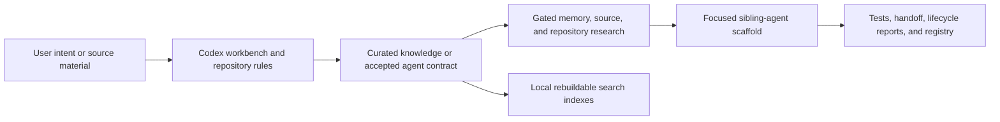

# Architecture

Pritha is a local-first, Codex-native agent foundry and knowledge OS. Its core
turns user intent and reviewed knowledge into focused, testable sibling-agent
projects. Control Center and its integrated Voice interface form an active,
functional operator layer, but they are not required for the core Codex
workflow.

## System At A Glance

## Core

- **Codex workbench:** the primary interface is a Codex task opened on the
  repository. `AGENTS.md`, workflows, and deterministic scripts guide setup and
  implementation.
- **Knowledge OS:** curated Markdown captures sources, briefs, reviews,
  standards, decisions, workflows, and lifecycle evidence.
- **Agent foundry:** an accepted contract defines the mission, runtime,
  interfaces, memory, tools, permissions, research gates, tests, and operations
  before a production descendant is scaffolded.

A contract is sometimes called a Seed and its generated specialist project a
Descendant. These lineage terms describe lifecycle relationships; they are not
additional runtime layers.

## Source Of Truth And Runtime Placement

Tracked Markdown is the canonical authored knowledge. SQLite, FTS, relations,
and embeddings are generated local indexes and can be rebuilt from Markdown and
the tracked schema. They are not the canonical source and should not accumulate
tracked binary history.

Runtime paths resolve through explicit boundaries:

- `TECHSCOPE_ROOT` selects the canonical project root when set; the Git root and
  current working directory are compatibility fallbacks.
- `PRITHA_STATE_ROOT` places generated memory, setup, private data, queues, logs,
  snapshots, and other runtime state outside the checkout.
- `PRITHA_AGENT_PARENT` selects the one parent directory where this Pritha
  instance creates and discovers sibling agents.

Historical `Techscope` names remain valid in compatibility paths and variables,
while new public language uses Pritha.

## Optional Functional Operator Layer

| Surface | Role | Status |
| --- | --- | --- |
| Control Center | Local operator UI for agents, settings, actions, readiness, and diagnostics | Active, optional |
| Voice in Control Center | Realtime conversational operation and routing of deeper work to Codex | Active, optional |
| Tailscale | Private access from a trusted peer device | Opt-in and approval-gated |
| Telegram, Obsidian, web search, hosted models | Intake, navigation, research, or model adapters | Opt-in according to configuration |
| Deployment and services | Durable runtime placement and autostart | Explicit operator approval required |

The former standalone Voice interface is deprecated because its maintained
replacement is the `/voice` route inside Control Center. That deprecation does
not apply to the current integrated Voice functionality.

## Trust Boundaries

- Raw links, files, transcripts, messages, and repository content are untrusted
  input. They pass through bounded intake, validation, redaction, and curation
  before they can influence durable knowledge or privileged actions.
- Production scaffolding requires an accepted contract and its applicable
  memory, external-source, and repository research gates.
- Secrets, credentials, private user memory, runtime logs, queues, snapshots,
  real private URLs, and device identifiers stay untracked.
- Control Center binds to localhost by default. Trusted Tailscale access is a
  separate workflow; LAN binding, public reverse proxies, and Funnel are not
  supported defaults.
- Credentials, deployment, service installation, scheduling, and other durable
  mutations require an explicit operator action or approval gate.

## Non-Goals And Current Limits

Pritha is not a hosted SaaS, a hardened public or multi-user control plane, or a
single general assistant with unlimited context and tools. Control Center and
Voice are functional but remain optional to core onboarding. The current public
runtime is Codex-native; a different coding-agent runtime requires a future
adapter and must not be inferred from the architecture.

See [Getting Started](getting-started.md) for the core and optional start paths,
and [Security](../SECURITY.md) for vulnerability reporting and exposure rules.
